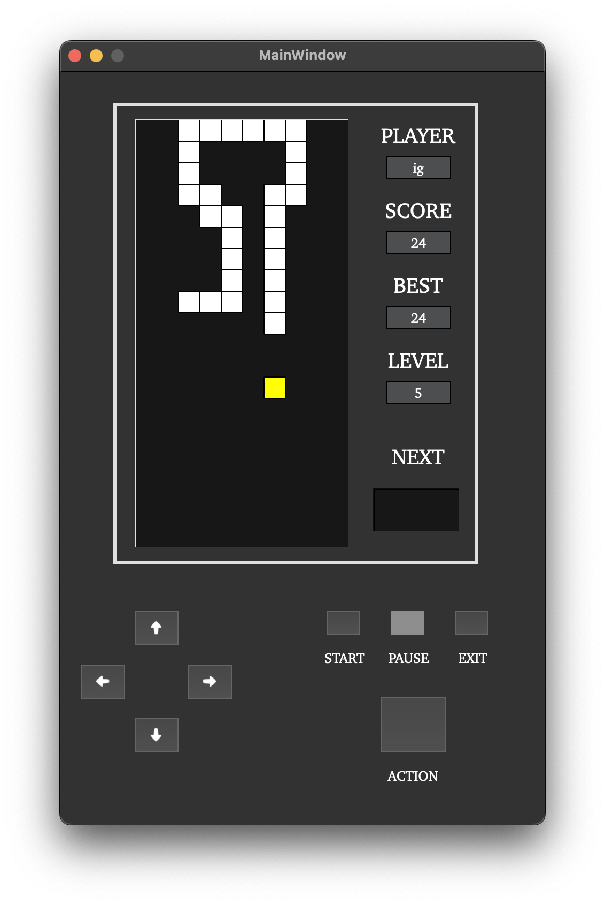

# CPP_BrickGame
Implementation of Snake game using C++ programming language and object-oriented approach

## Description

This project is an extension of my [C_BrickGame](https://github.com/igorgrichanov/C_BrickGame) project. Tetris game from [C_BrickGame](https://github.com/igorgrichanov/C_BrickGame) is included in this project and supports **console** and **desktop** interfaces as Snake game does

To run console game app:

```
cd src/
make
./build/brickgame_cli
```

<p align="center">
  
</p>

To run desktop game app:

```
cd src/
make
open build/desktop.app
```
<p align="center">
  
</p>

**NOTE**: to run desktop app, Qt library is required. You can download Qt from the [official website](https://www.qt.io/download-dev)

## Important notes

- The program has been developed in C++ language of C++17 standard using gcc compiler;
- The program consists of two parts: library implementing game logic, and interface;
- Project architecture follows MVC pattern;
- Both Tetris from [C_BrickGame](https://github.com/igorgrichanov/C_BrickGame) and Snake games support both desktop and console interface;
- Game field size is 10x20 like in BrickGame Console;
- Initial Snake length is 4;
- The Snake game logic is developed using finite state machine (FSM);
- Library code follows the Google style;
- Full coverage of library functions code has been prepared with unit-tests using the GTest library;
- The gcov_report target generates a gcov report in the form of an html page.

## Information

The Snake game goal is to eat "apples" and score as much points as possible. The user controls the snake via arrow buttons on keyboard or panel. The snake moves forward according to the current direction. One eaten apple gives one point. If the snake touches the borders or itself, the game is over. If the snake length reaches 200, the game is won.

## Available actions:

Change direction with ⬅️➡️⬆️⬇️ buttons on keyboard or panel. The snake can only turn left/right relative to the current direction.

To speed up the snake, press SPACE on the keyboard or ACTION on the panel.

To pause (continue) the game, press "p" on the keyboard or PAUSE on the panel.

To exit the game, press "q" on the keyboard or EXIT on the panel.

## Features

### Points scoring

Every eaten apple increases the score by 1. The maximum score is 196, i.e. where the snake fills the whole game field.

### Levels

Every 5 pts increase the level by 1. The maximum level is 10.

The higher the level, the higher the speed.

### Record storing

User record is saved between game launches

## FSM for Snake


- START_STATE – initial game state (main menu);
- SPAWN_STATE – adding a point and placing a new apple to the game field;
- MOVING_STATE – user input processing;
- SHIFTING_STATE – the snake moves forward according to the current direction. Check if the snake touched field borders or itself: if not, return to the MOVING_STATE. Else go to the END_STATE;
- PAUSE_STATE
- END_STATE – check if the record was broken. Exit to main menu
- EXIT_STATE – user decided to leave the game. Freeing up resources 
